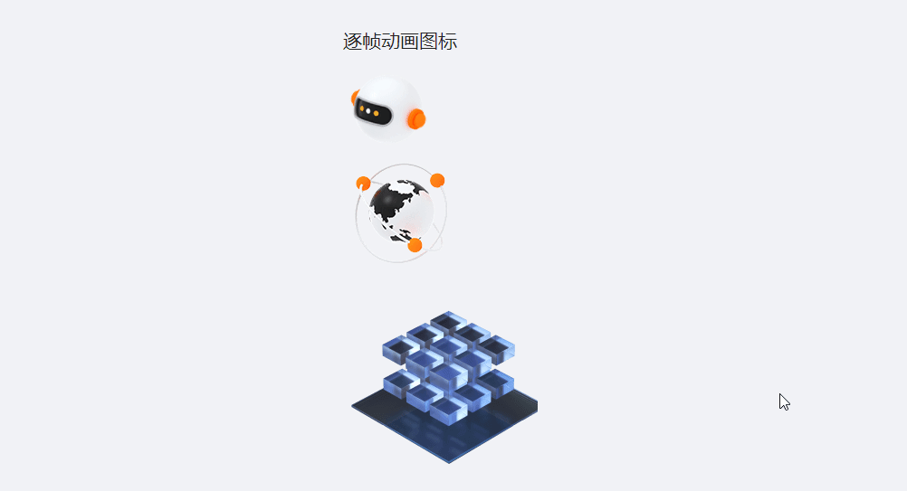

# vue-animated-icon 

仿阿里云首页动态图标，使用逐帧动画形式将雪碧图(Sprite)渲染为可交互的动画。

[https://zachxia.github.io/vue-animated-icon/demo/](https://zachxia.github.io/vue-animated-icon/demo/)



## Examples

```html
<template>
  <div class="main">
    <h2>逐帧动画图标</h2>
    <animated-icon
      src="https://img.alicdn.com/imgextra/i4/19999999999999/O1CN019FqNuv2NjaswQicY2_!!19999999999999-2-tps.png"
      :width="100"
      :steps="20"
    />
    <animated-icon
      src="https://img.alicdn.com/tfs/TB111c4mz39YK4jSZPcXXXrUFXa-128-2688.png"
      :steps="20"
    />
    <animated-icon
      src="https://cloudcache.tencent-cloud.com/open_proj/proj_qcloud_v2/tea-portal-material-portal/images/ani-spriteeef.png"
      :width="215"
      :height="216"
      :steps="37"
    />
  </div>
</template>

<script>
import AnimatedIcon from '@/components/AnimatedIcon'

export default {
  components: {
    AnimatedIcon,
  },
}
</script>
```

## API

| 参数  | 说明  | 类型 | 必填 | 默认值
|  ----  | ----  | ----| ----| ---- | 
|  src | 图像URL | String | 是 | - |
|  steps | 步数，指图像切换的次数。一般等于(总高度/单帧高度)-1 | Number | 是| -
|  width | 宽度 | Number | 否 |  128
|  height | 高度，缺省则等于宽度 | Number | 否 | width
